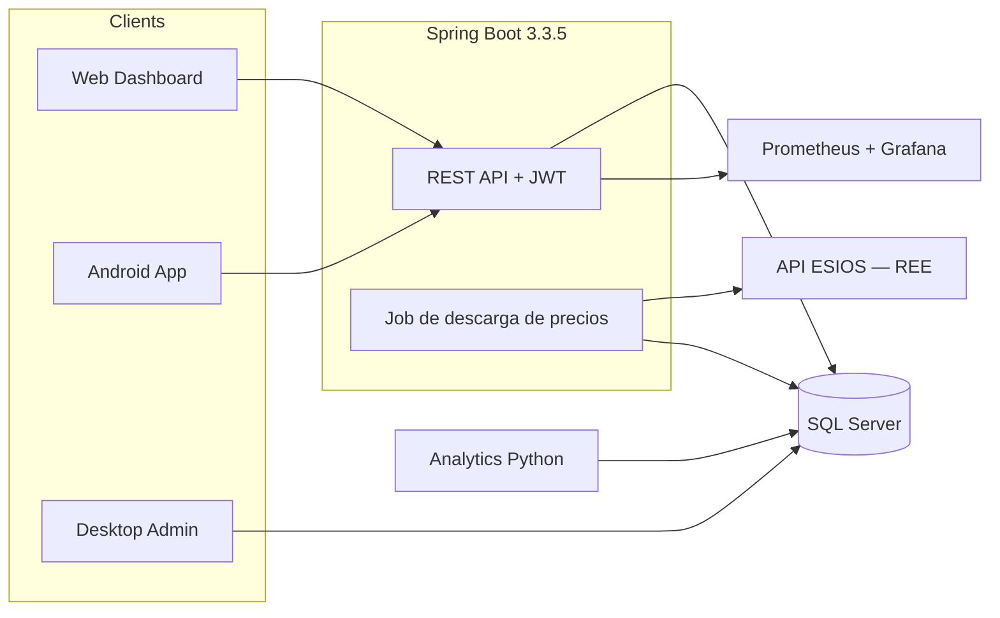

# WattWise

**Optimizador personal del coste eléctrico para el PVPC horario español**

[](LICENSE)
[](https://adoptium.net/)
[](https://spring.io/projects/spring-boot)
[](https://www.python.org/)
[](https://developer.android.com)

Desde septiembre de 2025, la tarifa regulada española (PVPC) publica **96 precios al día** — uno cada 15 minutos. La diferencia entre el tramo más barato y el más caro puede superar el 400%. WattWise ingiere esos precios desde [ESIOS (Red Eléctrica)](https://apidatos.ree.es/es/datos/mercados/precios-mercados-tiempo-real), clasifica cada tramo con un sistema de semáforo y te indica las ventanas más baratas para poner tus electrodomésticos.

---

## Arquitectura



Detalles completos de la arquitectura: [`docs/architecture/architecture.md`](docs/architecture/architecture.md)

---

## Stack tecnológico

| Módulo | Stack | Qué hace |
|---|---|---|
| `backend/` | Spring Boot 3.3.5, Java 17, Maven, JWT, Flyway | API REST, ingesta de precios, recomendaciones, alertas |
| `web/` | HTML5, CSS3, jQuery 3.7.1 | Dashboard con gráfico horario de semáforo, login, CRUD de electrodomésticos |
| `android/` | Java, Room, WorkManager, minSdk 26 | Cliente móvil, caché offline, notificaciones locales |
| `analytics-python/` | Flask, SQLAlchemy 2.x, pandas, prometheus_client | Estadísticas, estimaciones de ahorro, tendencias |
| `desktop-admin/` | Java 17 Swing, JDBC, Apache Commons CSV | Import/export CSV, corrección de precios, herramientas de administración |
| `docker/` | Docker Compose, Nginx, Prometheus, Grafana | Stack contenerizado + observabilidad |

---

## Estructura del proyecto

```
WattWise/
├── backend/                    API REST Spring Boot
├── web/                        Dashboard estático (HTML/CSS/jQuery)
├── android/                    App nativa Android
├── analytics-python/           Microservicio de analítica Flask
├── desktop-admin/              Herramienta de administración Java Swing
├── docker/                     Archivos Compose, Dockerfiles, configuración nginx
├── docs/                       Documentación de arquitectura, ADRs
└── scripts/                    Scripts auxiliares (en progreso)
```

---

## Primeros pasos

### Prerrequisitos

- **Java 17** — [Adoptium](https://adoptium.net/) u Oracle JDK
- **Maven 3.9+** — [maven.apache.org](https://maven.apache.org/)
- **Python 3.11+** — probado con 3.11 en Docker y 3.14 en local
- **Docker y Docker Compose v2** — [docker.com](https://www.docker.com/)
- **Android Studio** — para el módulo Android

### Inicio rápido con Docker

```bash
git clone https://github.com/Manstor21/WattWise.git
cd WattWise

# Copia y edita las variables de entorno
cp docker/.env.example docker/.env

# Arranca el stack completo (7 contenedores: nginx, backend, sql-server,
# analytics-python, prometheus, grafana, blackbox-exporter)
docker compose -f docker/docker-compose.yml up --build
```

> **PowerShell en Windows:** ejecuta el mismo comando desde la raíz del repo con
> `-f`, o entra en `docker` y usa `docker compose` a secas. Algunos marcadores de
> `docker/.env.example` van entre comillas — consérvalas; PowerShell interpreta
> el `$` sin comillas dentro de cadenas con comillas dobles.

Servicios una vez en marcha:

| Servicio | URL | Notas |
|---|---|---|
| Web Dashboard | http://localhost:8080 | a través del proxy inverso Nginx |
| API (Swagger) | http://localhost:8080/swagger-ui.html | requiere autenticación JWT |
| API de Analytics | http://localhost:5001/ready | directa, sin proxy del backend |
| Grafana | http://localhost:3000 | credenciales de `GRAFANA_ADMIN_USER` / `GRAFANA_ADMIN_PASSWORD` en `.env` |
| Prometheus | http://localhost:9090 | scraping de métricas (6/6 targets en healthy) |

Todos los secretos vienen de variables de entorno — consulta `docker/.env.example` para la lista completa. **Nunca hagas commit de `.env`.**

### Desarrollo local (sin Docker)

```bash
# Opción A: usar SQLite (no necesitas servidor de base de datos)
export SPRING_PROFILES_ACTIVE=dev
cd backend && mvn spring-boot:run

# Opción B: SQL Server vía Docker
docker run -e "ACCEPT_EULA=Y" -e "SA_PASSWORD=<tu-password>" -p 1433:1433 mcr.microsoft.com/mssql/server:2022-latest

# Microservicio de analítica (app.main no tiene bloque `__main__`; usa gunicorn o flask)
cd analytics-python
python -m venv venv
venv\Scripts\activate          # Windows
# source venv/bin/activate     # Linux/Mac
pip install -r requirements.txt
pip install gunicorn pyodbc   # dependencias solo-contenedor, también necesarias fuera de Docker
gunicorn --bind 0.0.0.0:5000 "app.main:create_app()"

# Web dashboard — sirve web/ con cualquier servidor de estáticos
```

#### Backtesting con histórico PVPC

`GET /api/backtest/report?months=12` (autenticado con JWT) compara el coste de
ejecutar los electrodomésticos al precio medio del día frente a usar las ventanas
óptimas del motor de recomendaciones. Simula sobre 12 meses de precios PVPC del
dataset de ejemplo [`pvpc-history-sample.csv`](backend/src/main/resources/backtest/pvpc-history-sample.csv).

---

## Solución de problemas

- **Backend atascado en bucle de reinicio (`Restarting (1)`)** — normalmente es
  una base de datos residual: una ejecución anterior creó objetos en `dbo` sobre
  los que Flyway se niega a migrar (`Found non-empty schema(s) [dbo] but no
  schema history table`). Resetea el volumen de SQL Server (ojo: `docker compose
  down -v` puede NO eliminar el volumen nombrado personalizado):
  ```bash
  docker compose -f docker/docker-compose.yml down
  docker volume rm wattwise-sqlserver-data
  docker compose -f docker/docker-compose.yml up --build
  ```
- **`/api/prices/today` devuelve `[]`** — `ESIOS_API_TOKEN` en `docker/.env` es
  el marcador `your-esi-os-api-token`. Consigue un token gratuito en
  [ESIOS/REE](https://api.esios.ree.es/) y ponlo en `.env`.
- **Errores de login / conexión de Flyway en el primer arranque** — SQL Server
  tarda ~30–60 s en ejecutar sus scripts de init antes de aceptar conexiones.
  Los contenedores se reinician hasta quedar healthy; espera a que `docker
  compose ps` muestre todo en verde.
- **Se pide recrear volúmenes al cambiar el esquema** — es lo esperado: V1/V2 se
  aplican sobre un volumen limpio; los cambios de esquema deben ser nuevas
  migraciones de Flyway (`V3__.sql`), no ediciones de las ya aplicadas.

---

## Hoja de ruta

### Completado

- **Backend** — API REST Spring Boot con autenticación JWT, ingesta de precios de ESIOS, motor de semáforo, motor de recomendaciones (patrón Strategy), sistema de alertas (patrón Observer), migraciones Flyway (V1/V2), persistencia dual (SQLite dev / SQL Server prod), springdoc-openapi
- **Backtesting con 12 meses de datos históricos PVPC** — `GET /api/backtest/report?months=12` (JWT) simula el motor de semáforo y de recomendaciones sobre el dataset de ejemplo incluido en el repo (`backend/src/main/resources/backtest/pvpc-history-sample.csv`, 12 meses de precios PVPC simulados con slots de 15 min en UTC). Con `ESIOS_API_TOKEN` real y la ingesta diaria en ejecución durante 12 meses, el mismo pipeline funciona sobre datos reales.
- **Web Dashboard** — gráfico horario de semáforo, login/registro, CRUD de electrodomésticos, tarjetas de recomendación
- **Android App** — caché offline Room, sincronización periódica WorkManager, notificaciones locales, JWT en EncryptedSharedPreferences
- **Notificaciones push FCM** — registro de tokens de dispositivo por usuario (`push_tokens`), envío admin a un token/usuario/broadcast (`POST /api/push/send`), receptor Android `WattwiseFcmService`; las notificaciones locales offline-first de ADR-005 siguen siendo la vía principal (ADR-006)
- **Microservicio de Analítica** — servicio Flask con `/health`, `/ready` y endpoints de analítica (medias por día de la semana, estimaciones de ahorro, tendencias, anomalías)
- **Desktop Admin** — herramienta Java Swing para import/export CSV, corrección de precios, acceso JDBC directo
- **Docker Compose** — 6 servicios configurados (nginx, backend, sql-server, analytics, prometheus, grafana) con overrides dev/prod
- **CI/CD** — pipeline de GitHub Actions: tests unitarios por módulo (backend con umbral de cobertura JaCoCo, Android, analítica, desktop-admin), smoke test web, validación de compose y build de imágenes Docker
- **Smoke test de Docker Compose** — arranque end-to-end verificado (2026-09-08): migraciones sobre SQL Server limpio vía Flyway (V1/V2), registro/login JWT, CRUD de electrodomésticos, recomendaciones, `/health`/`/ready` de analítica, Prometheus 6/6 targets up, login de Grafana

### En progreso

- Capturas de pantalla para el README (dashboard, Grafana, app Android)

---

## Registro de Decisiones de Arquitectura

Todas las decisiones técnicas relevantes están documentadas en [`docs/adr/`](docs/adr/):

- **ADR-001: Separación de microservicios** — Por qué la analítica vive en un servicio Python separado (Pandas es la herramienta adecuada para series temporales; las alternativas Java son más pesadas y con menos soporte comunitario)
- **ADR-002: Persistencia dual SQL Server + SQLite** — El servidor usa SQL Server; dev/demo/escritorio usan SQLite; Android tiene su propia caché Room
- **ADR-003: Estrategia de resiliencia de la API ESIOS** — Reintentos con backoff exponencial, gestión de datos obsoletos, alertas de publicación tardía
- **ADR-004: Monorepo frente a polyrepo** — Cambios atómicos entre módulos, un único archivo Docker Compose, un clon para tenerlo todo
- **ADR-005: Notificaciones locales frente a FCM** — Notificaciones offline-first vía WorkManager como vía principal; sin dependencia de red salvo la sincronización periódica
- **ADR-006: Notificaciones push por FCM iniciadas por servidor** — Extiende ADR-005: Firebase Admin SDK opcional en el backend (503 si no hay service account), tabla `push_tokens`, envío admin por token/usuario/broadcast, receptor `WattwiseFcmService` en Android

Análisis completo de trade-offs: [`docs/architecture/architecture.md`](docs/architecture/architecture.md#key-architectural-decisions--trade-offs)

---

## Contribuciones

1. Haz un fork del repositorio
2. Crea una rama de funcionalidad (`git checkout -b feature/mi-funcionalidad`)
3. Haz commits con mensajes conventional (`feat:`, `fix:`, `docs:`, `chore:`)
4. Haz push y abre una Pull Request

---

## Licencia

Este proyecto está bajo la **Licencia MIT** — consulta [`LICENSE`](LICENSE) para más detalles.

---

## Fuentes de datos y agradecimientos

- **Datos de precios:** [ESIOS — Red Eléctrica de España](https://apidatos.ree.es/es/datos/mercados/precios-mercados-tiempo-real) — API pública de datos del mercado eléctrico español
- **Regulación PVPC:** [BOE — Boletín Oficial del Estado](https://www.boe.es/)