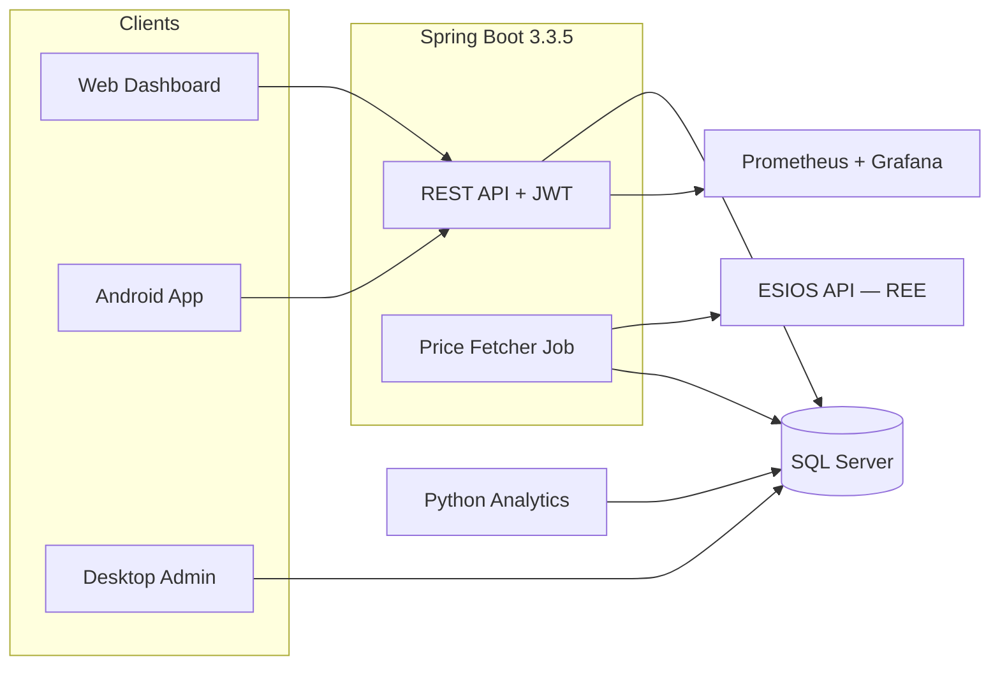

# WattWise

**Personal electricity cost optimizer for Spain's hourly PVPC pricing**

[](LICENSE)
[](https://adoptium.net/)
[](https://spring.io/projects/spring-boot)
[](https://www.python.org/)
[](https://developer.android.com)

Since September 2025, Spain's regulated tariff (PVPC) publishes **96 prices per day** — one every 15 minutes. The gap between the cheapest and most expensive slot can exceed 400%. WattWise ingests those prices from [ESIOS (Red Eléctrica)](https://apidatos.ree.es/es/datos/mercados/precios-mercados-tiempo-real), classifies every slot with a traffic-light system, and tells you the cheapest windows to run your appliances.

---

## Architecture



Full architecture details: [`docs/architecture/architecture.md`](docs/architecture/architecture.md)

---

## Tech Stack

| Module | Stack | What it does |
|---|---|---|
| `backend/` | Spring Boot 3.3.5, Java 17, Maven, JWT, Flyway | REST API, price ingestion, recommendations, alerts |
| `web/` | HTML5, CSS3, jQuery 3.7.1 | Dashboard with traffic-light hourly chart, login, appliance CRUD |
| `android/` | Java, Room, WorkManager, minSdk 26 | Mobile client, offline cache, local notifications |
| `analytics-python/` | Flask, SQLAlchemy 2.x, pandas, prometheus_client | Statistical analytics, savings estimates, trends |
| `desktop-admin/` | Java 17 Swing, JDBC, Apache Commons CSV | CSV import/export, price correction, admin tools |
| `docker/` | Docker Compose, Nginx, Prometheus, Grafana | Containerized stack + observability |

---

## Project Structure

```
WattWise/
├── backend/                    Spring Boot REST API
├── web/                        Static dashboard (HTML/CSS/jQuery)
├── android/                    Android native app
├── analytics-python/           Flask analytics microservice
├── desktop-admin/              Java Swing admin tool
├── docker/                     Compose files, Dockerfiles, nginx config
├── docs/                       Architecture docs, ADRs
└── scripts/                    Helper scripts (in progress)
```

---

## Getting Started

### Prerequisites

- **Java 17** — [Adoptium](https://adoptium.net/) or Oracle JDK
- **Maven 3.9+** — [maven.apache.org](https://maven.apache.org/)
- **Python 3.11+** — tested with 3.11 in Docker and 3.14 locally
- **Docker & Docker Compose v2** — [docker.com](https://www.docker.com/)
- **Android Studio** — for the Android module

### Quick Start with Docker

```bash
git clone https://github.com/Manstor21/WattWise.git
cd WattWise

# Copy and edit environment variables
cp docker/.env.example docker/.env

# Start the full stack (7 containers: nginx, backend, sql-server,
# analytics-python, prometheus, grafana, blackbox-exporter)
docker compose -f docker/docker-compose.yml up --build
```

> **Windows PowerShell:** run the same command from the repo root with `-f`,
> or `cd docker` and plain `docker compose`. Some placeholders in
> `docker/.env.example` are wrapped in quotes — keep them; PowerShell strips
> unquoted `$` inside double-quoted strings.

Services once running:

| Service | URL | Notes |
|---|---|---|
| Web Dashboard | http://localhost:8080 | via Nginx reverse proxy |
| API (Swagger) | http://localhost:8080/swagger-ui.html | JWT auth required |
| Analytics API | http://localhost:5001/ready | direct, not proxied by the backend |
| Grafana | http://localhost:3000 | credentials from `GRAFANA_ADMIN_USER` / `GRAFANA_ADMIN_PASSWORD` in `.env` |
| Prometheus | http://localhost:9090 | metrics scrape (6/6 targets when healthy) |

All secrets come from environment variables — see `docker/.env.example` for the full list. **Never commit `.env`.**

### Local Development (without Docker)

```bash
# Option A: use SQLite (no database server needed)
export SPRING_PROFILES_ACTIVE=dev
cd backend && mvn spring-boot:run

# Option B: run SQL Server via Docker
docker run -e "ACCEPT_EULA=Y" -e "SA_PASSWORD=<your-password>" -p 1433:1433 mcr.microsoft.com/mssql/server:2022-latest

# Analytics microservice (app.main has no `__main__` block; run via gunicorn or flask)
cd analytics-python
python -m venv venv
venv\Scripts\activate          # Windows
# source venv/bin/activate     # Linux/Mac
pip install -r requirements.txt
pip install gunicorn pyodbc   # container-only deps, needed outside Docker too
gunicorn --bind 0.0.0.0:5000 "app.main:create_app()"

# Web dashboard — serve web/ with any static file server
```

---

## Troubleshooting

- **Backend stuck in `Restarting (1)` crash-loop** — usually a leftover database:
  a previous run created objects in `dbo` that Flyway refuses to migrate over
  (`Found non-empty schema(s) [dbo] but no schema history table`). Reset the
  SQL Server volume (note: `docker compose down -v` may NOT remove the custom
  named volume):
  ```bash
  docker compose -f docker/docker-compose.yml down
  docker volume rm wattwise-sqlserver-data
  docker compose -f docker/docker-compose.yml up --build
  ```
- **`/api/prices/today` returns `[]`** — `ESIOS_API_TOKEN` in `docker/.env` is
  the placeholder `your-esi-os-api-token`. Get a free token from
  [ESIOS/REE](https://api.esios.ree.es/) and put it in `.env`.
- **Login failed / Flyway connection errors on first boot** — SQL Server takes
  ~30–60s to run its init scripts before accepting connections. Containers
  restart until healthy; wait for `docker compose ps` to show all green.
- **Prompted to recreate volumes after changing schema** — expected: V1/V2 are
  applied on a clean volume; schema changes should be new Flyway migrations
  (`V3__.sql`), not edits to applied ones.

---

## Roadmap

### Completed

- **Backend** — Spring Boot REST API with JWT auth, price ingestion from ESIOS, traffic-light engine, recommendation engine (Strategy pattern), alert system (Observer pattern), Flyway migrations (V1/V2), dual persistence (SQLite dev / SQL Server prod), springdoc-openapi
- **Web Dashboard** — traffic-light hourly chart, login/register, appliance CRUD, recommendation cards
- **Android App** — Room offline cache, WorkManager periodic sync, local notifications, JWT in EncryptedSharedPreferences
- **Analytics Microservice** — Flask service with `/health`, `/ready`, and analytics endpoints (weekday averages, savings estimates, trends, anomalies)
- **Desktop Admin** — Java Swing tool for CSV import/export, price correction, direct JDBC access
- **Docker Compose** — 6 services configured (nginx, backend, sql-server, analytics, prometheus, grafana) with dev/prod overrides
- **CI/CD** — GitHub Actions pipeline: per-module unit tests (backend with JaCoCo coverage gate, Android, analytics, desktop-admin), web smoke test, compose validation and Docker image builds
- **Docker Compose smoke test** — full-stack end-to-end boot verified (2026-09-08): clean-SQL-Server migrations via Flyway (V1/V2), JWT register/login, appliance CRUD, recommendations, analytics `/health`/`/ready`, Prometheus 6/6 targets up, Grafana login

### Still in progress

- Screenshots for the README (dashboard, Grafana, Android app)
- FCM push notifications (documented as extension in ADR-005)
- Backtesting with 12 months of historical PVPC data

---

## Architecture Decision Records

All significant technical decisions are documented in [`docs/adr/`](docs/adr/):

- **ADR-001: Microservice Separation** — Why analytics lives in a separate Python service (Pandas is the right tool for time-series; Java alternatives are heavier and less community-supported)
- **ADR-002: SQL Server + SQLite Dual Persistence** — Server uses SQL Server; dev/demo/desktop use SQLite; Android has its own Room cache
- **ADR-003: ESIOS API Resilience Strategy** — Retry with exponential backoff, stale data handling, late publication alerts
- **ADR-004: Monorepo over Polyrepo** — Cross-module atomic changes, single Docker Compose file, one clone to get everything
- **ADR-005: Local Notifications over FCM** — Offline-first notifications via WorkManager; no Firebase project setup needed, no device tokens leave the device

Full trade-off analysis: [`docs/architecture/architecture.md`](docs/architecture/architecture.md#key-architectural-decisions--trade-offs)

---

## Contributing

1. Fork the repository
2. Create a feature branch (`git checkout -b feature/my-feature`)
3. Commit with conventional commits (`feat:`, `fix:`, `docs:`, `chore:`)
4. Push and open a Pull Request

---

## License

This project is licensed under the **MIT License** — see [`LICENSE`](LICENSE) for details.

---

## Data Sources & Acknowledgments

- **Price data:** [ESIOS — Red Eléctrica de España](https://apidatos.ree.es/es/datos/mercados/precios-mercados-tiempo-real) — Public API for Spanish electricity market data
- **PVPC regulation:** [BOE — Boletín Oficial del Estado](https://www.boe.es/)
