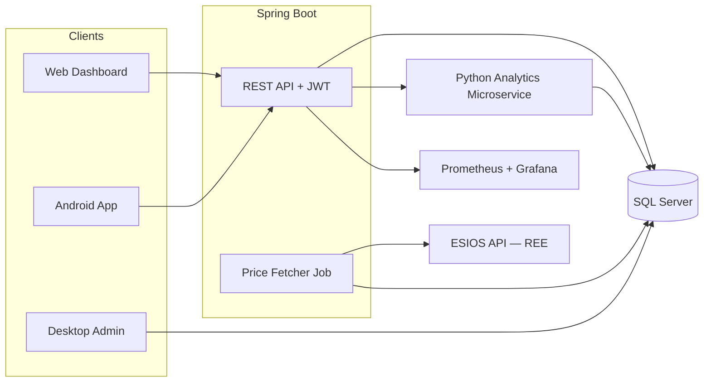

# ⚡ WattWise

**Personal electricity cost optimizer based on Spain's hourly PVPC pricing**


> **Tell your washing machine when to run.** WattWise ingests Spain's real-time electricity prices from Red Eléctrica (ESIOS API), classifies every 15-minute slot with a traffic-light system, and recommends the cheapest windows for your appliances — so you stop overpaying.

---

## The Problem

Since September 2025, Spain's regulated electricity tariff (PVPC) publishes **96 different prices per day** — one every 15 minutes. The difference between the cheapest and most expensive hour can exceed **400%**. A family running a washing machine at the wrong time pays 4× more than one running it at the right time.

Yet no consumer-friendly tool exists to tell you: *"Run the dishwasher between 02:00–04:00, not at 19:00."*

## The Solution

WattWise is a full-stack personal energy optimizer:

- **Ingests** 96 daily prices from [ESIOS — Red Eléctrica](https://apidatos.ree.es/es/datos/mercados/precios-mercados-tiempo-real)
- **Classifies** each slot into 🟢 green (cheap) / 🟡 amber (moderate) / 🔴 red (expensive) using a hybrid percentile + deviation + absolute-threshold algorithm
- **Recommends** optimal windows per appliance (washing machine, dishwasher, EV charger, dryer, pool pump, AC) using Strategy pattern
- **Notifies** you on Android when the best window starts — even offline
- **Visualizes** everything on a web dashboard with a color-coded hourly chart

---

## Architecture



→ Full architecture details: [`docs/architecture/architecture.md`](docs/architecture/architecture.md)

---

## Tech Stack

| Module | Technology | Purpose |
|---|---|---|
| `backend/` | Spring Boot 3.x, Java 17, Maven | REST API, JWT auth, price ingestion, recommendations |
| `web/` | HTML5, CSS3, vanilla JS, jQuery | Responsive dashboard with traffic-light visualization |
| `android/` | Android SDK (Java), WorkManager, Room | Mobile client, offline mode, local notifications |
| `analytics-python/` | Flask/FastAPI, Pandas, SQLAlchemy | Statistical analytics, savings estimation, trends |
| `desktop-admin/` | Java Swing, NetBeans, JDBC | CSV import/export, price correction, admin tools |
| `docker/` | Docker Compose, Nginx, Prometheus, Grafana | Containerized deployment + observability |

---

## Project Structure

```
WattWise/
├── backend/                    # Spring Boot REST API
│   ├── src/main/java/com/wattwise/
│   ├── src/test/java/com/wattwise/
│   └── pom.xml
├── web/                        # Static web dashboard (HTML/CSS/JS)
│   ├── index.html
│   ├── css/
│   ├── js/
│   └── assets/
├── android/                    # Android native app
│   ├── app/src/main/java/com/wattwise/android/
│   └── build.gradle
├── analytics-python/           # Python analytics microservice
│   ├── app/
│   ├── tests/
│   └── requirements.txt
├── desktop-admin/              # Java Swing admin tool
│   ├── src/main/java/com/wattwise/admin/
│   └── pom.xml
├── docker/                     # Docker Compose + Dockerfiles
│   ├── docker-compose.yml
│   ├── backend/
│   ├── web/
│   ├── nginx/
│   ├── prometheus/
│   └── grafana/
├── scripts/
│   ├── linux/                  # Bash scripts
│   └── windows/                # PowerShell / .bat scripts
├── docs/
│   ├── architecture/           # System architecture documentation
│   ├── adr/                    # Architecture Decision Records
│   └── deployment/             # Deployment guides
└── .github/workflows/          # CI/CD pipelines
```

---

## Getting Started

### Prerequisites

- **Java 17** — [Adoptium](https://adoptium.net/) or Oracle JDK
- **Maven 3.9+** — [maven.apache.org](https://maven.apache.org/)
- **Python 3.11+** — [python.org](https://www.python.org/)
- **Docker & Docker Compose** — [docker.com](https://www.docker.com/)
- **Android Studio** — [developer.android.com](https://developer.android.com/studio) (for Android module)

### Quick Start with Docker

```bash
# Clone the repository
git clone https://github.com/your-username/WattWise.git
cd WattWise

# Start the full stack (backend + database + analytics + monitoring)
docker-compose -f docker/docker-compose.yml up --build

# Access the services
# Web Dashboard:    http://localhost:8080
# API:              http://localhost:8080/api
# Grafana:          http://localhost:3000  (admin/wattwise)
# Prometheus:       http://localhost:9090
```

### Local Development (without Docker)

```bash
# 1. Start SQL Server (or use SQLite profile)
# Option A: Docker only for SQL Server
docker run -e "ACCEPT_EULA=Y" -e "SA_PASSWORD=WattWise2024!" -p 1433:1433 mcr.microsoft.com/mssql/server:2022-latest

# Option B: Use SQLite for local dev
export SPRING_PROFILES_ACTIVE=dev

# 2. Start the backend
cd backend
mvn spring-boot:run

# 3. Start the analytics microservice
cd analytics-python
python -m venv venv
venv\Scripts\activate          # Windows
# source venv/bin/activate     # Linux/Mac
pip install -r requirements.txt
python -m app.main

# 4. Open the web dashboard
# Serve web/ with any static file server, or open web/index.html directly
```

### Scripts

Platform-specific helper scripts are available in `scripts/`:

| Script | Purpose |
|---|---|
| `scripts/windows/start-full.bat` | Start the complete environment on Windows |
| `scripts/linux/start-full.sh` | Start the complete environment on Linux |
| `scripts/windows/backup-db.bat` | Back up the SQL Server database |
| `scripts/linux/backup-db.sh` | Back up the database on Linux |
| `scripts/windows/clean-logs.bat` | Purge old log files |

---

## Roadmap

### Block 1 — Foundation ✅ (Current)
- [x] Project structure and architecture documentation
- [ ] Backend: price ingestion from ESIOS, traffic-light engine, CRUD APIs
- [ ] Web dashboard: price chart, traffic-light grid, login
- [ ] Docker Compose: full stack local environment
- [ ] CI/CD: GitHub Actions build + test pipeline

### Block 2 — Intelligence
- [ ] Recommendation engine with Strategy pattern per appliance type
- [ ] Alert system with Observer pattern
- [ ] Android app: offline mode, local notifications via WorkManager
- [ ] Analytics microservice: weekday averages, savings estimates

### Block 3 — Polish
- [ ] Desktop admin: CSV import/export, price correction
- [ ] Advanced Grafana dashboards, alerting rules
- [ ] Historical trend analysis, anomaly detection
- [ ] Mobile responsive refinement, accessibility audit

### Block 4 — Scale
- [ ] Multi-user support refinement, rate limiting
- [ ] FCM notification extension (documented, optional)
- [ ] Database performance tuning, query optimization
- [ ] Backtesting with 12 months of historical PVPC data
- [ ] User study and threshold calibration

---

## Agile Management

- **Project board:** [GitHub Projects](https://github.com/users/your-username/projects) (Kanban: Backlog → In Progress → Review → Done)
- **Documentation:** `docs/` directory in-repo (no external wiki)
- **Decision tracking:** Architecture Decision Records in `docs/adr/`
- **Releases:** Tagged versions with GitHub Releases changelogs

---

## Architecture Decision Records

All significant technical decisions are documented in `docs/adr/`:

- [ADR-001: Microservice Separation](docs/adr/) — Why analytics lives in a separate Python service
- [ADR-002: SQL Server + SQLite Dual Persistence](docs/adr/) — How server and offline clients share data
- [ADR-003: ESIOS API Resilience Strategy](docs/adr/) — Retry, backoff, and stale data handling
- [ADR-004: Monorepo over Polyrepo](docs/adr/) — Cross-module atomic changes
- [ADR-005: Local Notifications over FCM](docs/adr/) — Offline-first notification approach

→ Full trade-off analysis: [`docs/architecture/architecture.md`](docs/architecture/architecture.md#key-architectural-decisions--trade-offs)

---

## Contributing

1. Fork the repository
2. Create a feature branch (`git checkout -b feature/my-feature`)
3. Commit with conventional commits (`feat:`, `fix:`, `docs:`, `chore:`)
4. Push and open a Pull Request
5. CI must pass (build + tests + coverage ≥ 70%)

See [`CONTRIBUTING.md`](CONTRIBUTING.md) for full guidelines (create as needed).

---

## License

This project is licensed under the **MIT License** — see [`LICENSE`](LICENSE) for details.

---

## Data Sources & Acknowledgments

- **Price data:** [ESIOS — Red Eléctrica de España](https://apidatos.ree.es/es/datos/mercados/precios-mercados-tiempo-real) — Public API for Spanish electricity market data
- **PVPC regulation:** [BOE — Boletín Oficial del Estado](https://www.boe.es/)
- Built with ❤️ for energy-conscious consumers in Spain
