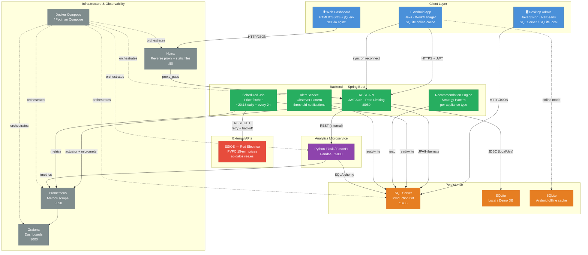
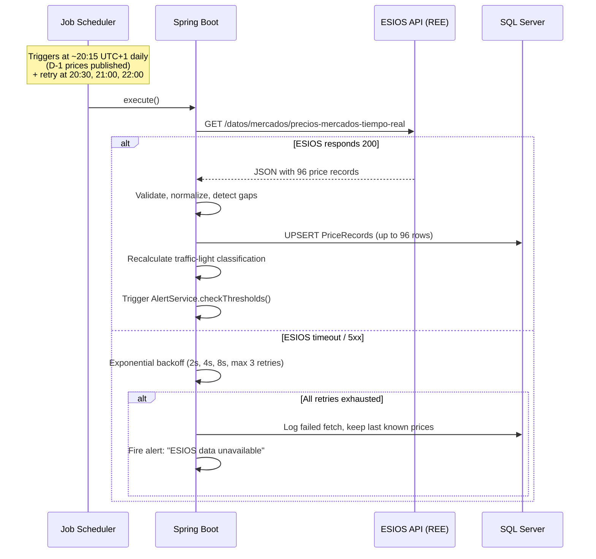
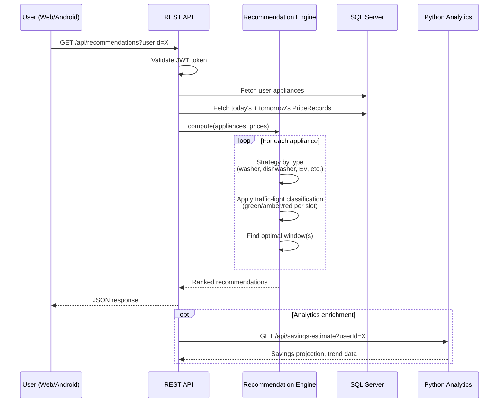

# WattWise — System Architecture

## Executive Summary

WattWise addresses the growing complexity of hourly electricity pricing in Spain's PVPC regulated market, where real-time prices now update every 15 minutes (up to 96 values per day) and can vary by over 400% between the cheapest and most expensive hours. The system ingests pricing data from Red Eléctrica de España's public ESIOS API, processes it through a Spring Boot backend, and delivers actionable recommendations — telling users when to run appliances, charge EVs, or shift loads — via a web dashboard, Android app, and desktop administration tool. A separate Python microservice provides statistical analytics. The architecture prioritizes reliability against an external API with no SLA, offline resilience on mobile, and operational simplicity through containerized deployment.

---

## High-Level Architecture Diagram

---

## Module Overview

| Module | Responsibility | Technology | Port | Input | Output |
|---|---|---|---|---|---|
| **backend** | REST API, business logic, scheduling, auth | Spring Boot 3.x, Java 17, Maven | `:8080` | HTTP JSON requests, ESIOS API responses | JSON API responses, DB writes, alert triggers |
| **web** | User-facing dashboard, traffic-light UI | HTML5, CSS3, vanilla JS, jQuery | `:80` (via nginx) | AJAX calls to backend API | Rendered dashboard, appliance schedules |
| **android** | Mobile client, offline mode, push-style local notifications | Android SDK (Java), WorkManager, Room/SQLite | — | API responses, local SQLite | UI, local notifications, cached data |
| **analytics-python** | Statistical analytics, price trends, savings estimates | Flask/FastAPI, Pandas, SQLAlchemy | `:5000` | SQL Server data, backend internal calls | JSON analytics endpoints |
| **desktop-admin** | Data admin: CSV import/export, price correction, job logs | Java Swing, NetBeans, JDBC | — | SQL Server direct + API | Admin UI, modified DB records |
| **infra** | Containerization, orchestration, observability | Docker, Docker Compose, Nginx, Prometheus, Grafana | `:80/:3000/:9090` | Config files, metrics | Running services, dashboards, alerts |

---

## Principal Data Flows

### 1. Daily Price Ingestion (Scheduled)

### 2. User Consultation & Recommendation

### 3. Android Offline ↔ Sync

```mermaid
sequenceDiagram
    participant App as Android App
    participant Local as SQLite (Room)
    participant API as REST API

    alt Online
        App->>API: GET /api/prices/today
        API-->>App: JSON prices
        App->>Local: Upsert PriceRecords
        App->>API: GET /api/recommendations
        API-->>App: JSON recommendations
        App->>Local: Cache recommendations
    else Offline
        App->>Local: Query cached prices
        Local-->>App: Last known prices + recommendations
        App->>App: Show traffic-light from cache<br/>+ "offline" indicator
    end

    Note over App: WorkManager periodic task (6h)<br/>tries sync when connectivity returns
    App->>API: Sync pending appliance changes
    API-->>App: Confirm sync
```

---

## Key Architectural Decisions & Trade-offs

### A. Separate Python Microservice for Analytics

**Decision:** Analytics live in a standalone Python Flask/FastAPI service, not inside the Spring Boot backend.

**Why:**
- **Library fit:** Pandas is the de-facto standard for time-series analysis, rolling windows, and statistical aggregation. Replicating this in Java would require引入ing Commons Math or similar with less community support.
- **Independent scaling:** Analytics queries (e.g., "average price by weekday over 6 months") are CPU-bound and can be scaled independently without restarting the main API.
- **Team flexibility:** A Python service lowers the barrier for data-science contributions without requiring Java expertise.

**Trade-offs accepted:**
- Network hop between backend and analytics (mitigated: both on same Docker network, internal REST call, <1ms latency).
- Two runtimes to maintain (mitigated: Docker encapsulates both).
- Data consistency requires SQL Server as single source of truth (both services read from it).

### B. SQL Server (Production) vs SQLite (Local/Offline)

**Decision:** SQL Server for all server-side persistence; SQLite for local dev/demo, desktop-admin local mode, and Android offline cache.

**Why:**
- **SQL Server** provides transactional integrity, concurrent access, full-text search, and aligns with enterprise deployment targets.
- **SQLite** requires zero setup for local development and demo, and is the only viable embedded DB on Android.
- **Synchronization** between Android SQLite and SQL Server is handled via a last-write-wins sync protocol over the REST API when connectivity is restored. The backend assigns server-side timestamps that override client timestamps on conflict.

**Trade-offs accepted:**
- SQL dialect differences (HQL/JPQL abstracts most; raw SQL scripts use dialect-specific syntax with profiles).
- SQLite lacks stored procedures and advanced indexing (acceptable for offline read-mostly cache).

### C. External API Resilience (ESIOS / REE)

**Decision:** Defensive ingestion with retries, fallbacks, and graceful degradation.

**Implementation:**
- **Retry with exponential backoff:** 3 attempts, base delay 2s, max delay 30s. Circuit breaker pattern after 5 consecutive failures.
- **Default values:** If ESIOS is unreachable after all retries, the system retains the last successfully fetched prices and marks them as `STALE`. The UI displays a "prices may be outdated" banner.
- **Late publication handling:** If prices for D+1 are not available by 22:00, the scheduler fires an alert and retries at 23:00 and 00:00.
- **Monitoring:** Prometheus counter `esiros_fetch_total{status}` tracks success/failure rates. Grafana alerts fire if failure rate > 50% over 24h.

**Trade-offs accepted:**
- No real-time price streaming (ESIOS does not offer WebSocket/SSE). Polling every 2h is sufficient for day-ahead market.
- Stale data risk is bounded by the retry schedule and made visible to users.

### D. Monorepo

**Decision:** All modules in a single Git repository with clear directory boundaries.

**Why:**
- **Atomic cross-module changes:** A backend API contract change and the corresponding web/Android consumer update can be committed together.
- **Simplified dependency management:** One CI/CD pipeline, one Docker Compose file, shared scripts.
- **Developer experience:** Single clone to get the full system; no need to coordinate across repositories.

**Trade-offs accepted:**
- Repository size grows over time (mitigated: `.gitignore` for build artifacts, LFS for large assets if needed).
- CI builds may be slower for unrelated changes (mitigated: path-based triggers in GitHub Actions).

### E. Local Notifications via WorkManager (Not FCM)

**Decision:** Android notifications are delivered locally via WorkManager + NotificationCompat. Firebase Cloud Messaging is documented as a future extension but not implemented in this phase.

**Why:**
- **No server dependency:** Local notifications work offline, aligning with the offline-first architecture.
- **No Firebase project setup:** Eliminates Google Cloud Console configuration, `google-services.json` management, and FCM token lifecycle.
- **Sufficient for use case:** The user needs a reminder at the optimal window — this is a local scheduling decision, not a server-pushed event.
- **Privacy:** No device tokens leave the device.

**Trade-offs accepted:**
- Cannot notify user of sudden price changes outside the pre-computed window (mitigated: WorkManager re-checks every 6h).
- No cross-device notification sync (acceptable for single-device personal use).

---

## Non-Functional Requirements

| Category | Requirement | Target |
|---|---|---|
| **Performance** | API response time (p95) | < 200ms for price queries, < 500ms for recommendations |
| **Performance** | Price ingestion latency (ESIOS → DB) | < 10s for full day (96 records) |
| **Availability** | System uptime | 99.5% (single-server deployment) |
| **Availability** | External API failure handling | Graceful degradation with stale data, max 5min user-visible delay |
| **Security** | Authentication | JWT with 24h expiry, refresh token rotation |
| **Security** | Transport | HTTPS enforced in production (Let's Encrypt / self-signed for local) |
| **Security** | Secrets management | Environment variables, Docker secrets — no hardcoded credentials |
| **Testing** | Backend unit test coverage | ≥ 70% (JaCoCo) |
| **Testing** | Integration tests | API contract tests for all REST endpoints |
| **Testing** | Android | Unit tests for ViewModels, instrumentation tests for Room DAOs |
| **Observability** | Metrics | Prometheus scrape for backend, analytics, and job scheduler |
| **Observability** | Dashboards | Grafana: price ingestion status, API latency, error rates, job runs |
| **Observability** | Logging | Structured JSON logs, retained 30 days, rotatable |
| **Data** | Price retention | Minimum 2 years of historical PVPC data |
| **Data** | Backup | Daily automated backup of SQL Server (script in `scripts/`) |
| **Compliance** | Data minimization | Only store user email, hashed password, appliance metadata — no payment data |
| **Compliance** | API usage | Respect REE API rate limits and terms of use |
