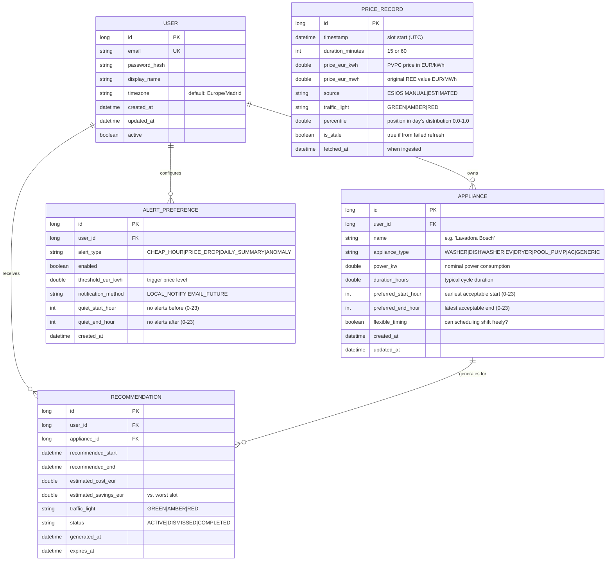

# WattWise — Data Model

Initial entity-relationship model for the WattWise system.

---

## Entity-Relationship Diagram

---

## Entity Descriptions

### USER

Core identity entity. One row per registered user.

| Field | Type | Constraints | Notes |
|---|---|---|---|
| `id` | BIGINT | PK, auto-increment | — |
| `email` | VARCHAR(255) | UNIQUE, NOT NULL | Login identifier |
| `password_hash` | VARCHAR(255) | NOT NULL | BCrypt hash, never plain text |
| `display_name` | VARCHAR(100) | — | Shown in UI greeting |
| `timezone` | VARCHAR(50) | DEFAULT 'Europe/Madrid' | For price slot interpretation |
| `created_at` | DATETIME | NOT NULL, DEFAULT NOW | — |
| `updated_at` | DATETIME | NOT NULL, DEFAULT NOW | Trigger-updated |
| `active` | BOOLEAN | DEFAULT TRUE | Soft-delete flag |

### APPLIANCE

User-defined electrical appliance with scheduling constraints.

| Field | Type | Constraints | Notes |
|---|---|---|---|
| `id` | BIGINT | PK, auto-increment | — |
| `user_id` | BIGINT | FK → USER, NOT NULL | Cascade delete on user removal |
| `name` | VARCHAR(100) | NOT NULL | User-friendly label |
| `appliance_type` | VARCHAR(30) | NOT NULL, ENUM | Drives Strategy selection |
| `power_kw` | DOUBLE | NOT NULL, > 0 | Used for cost estimation |
| `duration_hours` | DOUBLE | NOT NULL, > 0 | Cycle length in hours (can be fractional, e.g. 1.5) |
| `preferred_start_hour` | INT | DEFAULT 0 | Earliest acceptable start (24h) |
| `preferred_end_hour` | DEFAULT 23 | Latest acceptable end (24h) |
| `flexible_timing` | BOOLEAN | DEFAULT TRUE | If false, only optimize within preferred window |
| `created_at` | DATETIME | NOT NULL | — |
| `updated_at` | DATETIME | NOT NULL | — |

**Appliance Types:**

| Value | Description | Typical Duration | Notes |
|---|---|---|---|
| `WASHER` | Washing machine | 1.5–2.5h | Can delay start; water temp irrelevant to cost |
| `DISHWASHER` | Dishwasher | 1–2h | Can delay; similar to washer |
| `EV` | Electric vehicle charger | 2–8h | Highest flexibility; largest cost impact |
| `DRYER` | Clothes dryer | 1–3h | Moderate flexibility |
| `POOL_PUMP` | Swimming pool pump | 4–8h | High flexibility; often overnight |
| `AC` | Air conditioning / heat pump | Variable | Semi-flexible; comfort constraints |
| `GENERIC` | Any other appliance | User-defined | Fallback strategy |

### PRICE_RECORD

One row per price time slot. Up to 96 rows/day (15-min intervals) or 24 rows/day (60-min legacy).

| Field | Type | Constraints | Notes |
|---|---|---|---|
| `id` | BIGINT | PK, auto-increment | — |
| `timestamp` | DATETIME | NOT NULL | Slot start time in UTC |
| `duration_minutes` | INT | NOT NULL, IN (15, 60) | Slot granularity |
| `price_eur_kwh` | DOUBLE | NOT NULL | Processed price for display/calculation |
| `price_eur_mwh` | DOUBLE | NOT NULL | Raw value from ESIOS API |
| `source` | VARCHAR(10) | NOT NULL | Provenance tracking |
| `traffic_light` | VARCHAR(6) | — | GREEN / AMBER / RED (computed, nullable before classification) |
| `percentile` | DOUBLE | — | Slot position in daily distribution [0.0, 1.0] |
| `is_stale` | BOOLEAN | DEFAULT FALSE | True if price couldn't be refreshed |
| `fetched_at` | DATETIME | NOT NULL | Ingestion timestamp |

**Unique constraint:** `(timestamp, source)` — prevents duplicate ingestion.

**Index:** Composite index on `(timestamp, traffic_light)` for fast dashboard queries.

### ALERT_PREFERENCE

User-configured alert rules. One user can have multiple alert types.

| Field | Type | Constraints | Notes |
|---|---|---|---|
| `id` | BIGINT | PK, auto-increment | — |
| `user_id` | BIGINT | FK → USER, NOT NULL | — |
| `alert_type` | VARCHAR(20) | NOT NULL | See types below |
| `enabled` | BOOLEAN | DEFAULT TRUE | Quick toggle without deletion |
| `threshold_eur_kwh` | DOUBLE | — | Price level that triggers the alert |
| `notification_method` | VARCHAR(15) | DEFAULT 'LOCAL_NOTIFY' | Extensible for future email/push |
| `quiet_start_hour` | INT | DEFAULT 22 | Do-not-disturb window start |
| `quiet_end_hour` | INT | DEFAULT 7 | Do-not-disturb window end |
| `created_at` | DATETIME | NOT NULL | — |

**Alert Types:**

| Type | Trigger Condition | Default Threshold |
|---|---|---|
| `CHEAP_HOUR` | Price drops below threshold | 0.05 EUR/kWh |
| `PRICE_DROP` | Price falls >30% from previous slot | — (percentage-based) |
| `DAILY_SUMMARY` | End-of-day cheapest window summary | — (always at 21:00) |
| `ANOMALY` | Price > 2× daily average | — (computed) |

### RECOMMENDATION

Generated optimization suggestion. Immutable once created; status field tracks lifecycle.

| Field | Type | Constraints | Notes |
|---|---|---|---|
| `id` | BIGINT | PK, auto-increment | — |
| `user_id` | BIGINT | FK → USER, NOT NULL | — |
| `appliance_id` | BIGINT | FK → APPLIANCE, NOT NULL | — |
| `recommended_start` | DATETIME | NOT NULL | Optimal start time |
| `recommended_end` | DATETIME | NOT NULL | Computed as start + duration |
| `estimated_cost_eur` | DOUBLE | NOT NULL | Cost if user follows recommendation |
| `estimated_savings_eur` | DOUBLE | NOT NULL | Savings vs. worst available slot |
| `traffic_light` | VARCHAR(6) | NOT NULL | Color of the recommended window |
| `status` | VARCHAR(10) | DEFAULT 'ACTIVE' | ACTIVE / DISMISSED / COMPLETED |
| `generated_at` | DATETIME | NOT NULL | When recommendation was created |
| `expires_at` | DATETIME | NOT NULL | Recommendation valid until (typically end of day) |

---

## Storage Location Matrix

| Entity | SQL Server (Production) | SQLite (Local/Demo) | SQLite (Android Offline) | Notes |
|---|---|---|---|---|
| USER | ✅ | ✅ | ❌ | Android only stores local user ID + token |
| APPLIANCE | ✅ | ✅ | ✅ | Synced to Android for offline recommendations |
| PRICE_RECORD | ✅ | ✅ | ✅ | Last 3 days cached on Android |
| ALERT_PREFERENCE | ✅ | ✅ | ✅ | Synced; local notifications respect preferences |
| RECOMMENDATION | ✅ | ✅ | ✅ | Cached on Android; regenerated on sync |

---

## Android SQLite Schema Notes

The Android Room database uses the same table structure with these adaptations:

- **No foreign keys** enforced at DB level (Room validates in application layer).
- **Additional column:** `sync_status` (PENDING / SYNCED / CONFLICT) for offline sync tracking.
- **Additional column:** `server_updated_at` — server timestamp for conflict resolution.
- **Simplified types:** `DATETIME` stored as TEXT (ISO 8601), `DOUBLE` stored as REAL.
- **User table:** Not stored locally; Android only holds `user_id` (LONG) and JWT token in EncryptedSharedPreferences.

---

## Migration Strategy

- **Schema versioning:** Flyway for SQL Server (`db/migration/V1__init.sql`, `V2__add_recommendations.sql`, etc.).
- **Room migrations:** `@Database(version = N, autoMigrations = {...})` with explicit migration paths.
- **Backward compatibility:** New columns always have defaults; old clients continue to work.

---

## Sample Data Volume Estimates

| Table | Rows/Day | Rows/Year | Size Estimate |
|---|---|---|---|
| PRICE_RECORD | 96 | ~35,000 | ~15 MB |
| USER | — | ~5,000 (growth) | ~2 MB |
| APPLIANCE | ~100 (new) | ~36,500 | ~5 MB |
| RECOMMENDATION | ~500 | ~180,000 | ~50 MB |
| ALERT_PREFERENCE | — | ~2,000 | ~1 MB |

**Total estimate (1 year, 1000 users):** < 200 MB — well within SQL Server Express limits (10 GB).
